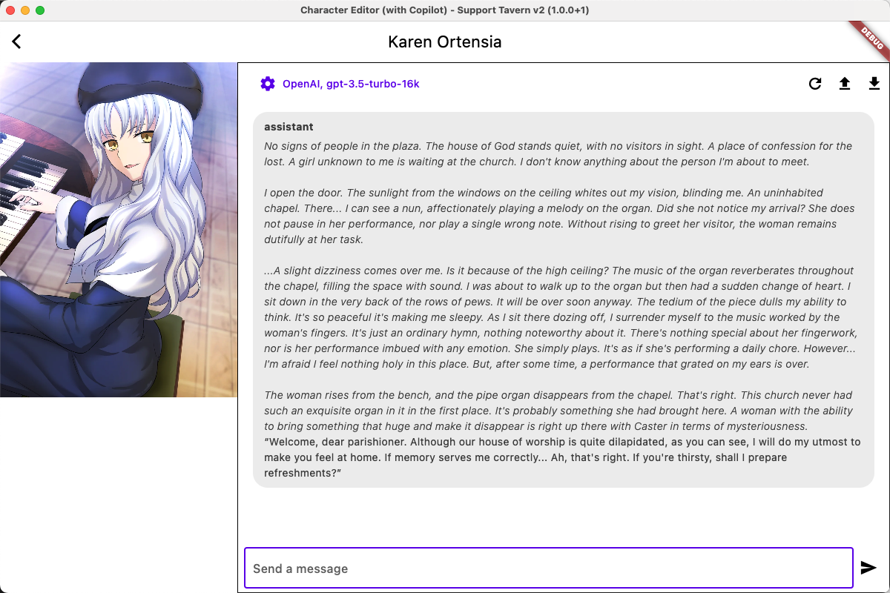

## Character Craft

An OpenSource Character Editor for Tavern v2 spec Character (Compatible with SillyTavern, CHUB) (Copilot your character creation and editing process)

This project is aimed to help character creators better creating and editing characters. (Using Tavern V2 PNG spec) Could be played used the following projects.

* The editor is in very early stage of developing, welcome to contact us through [report issues](https://github.com/windameister/CharacterCraft/issues).

* To build the project, you'll need to install:

	*  [flutter sdk](https://docs.flutter.dev/get-started/install)

* Build Step:

```
cd editor
# on mac
flutter run -d macos 
# on windows
flutter run -d windows

```


* If you do not want to build yourself, you could also download the prebuilt binary package directly:

Currently only tested on following supported platform: [Windows](https://github.com/windameister/CharacterCraft/releases/download/v1.0.0.2/Character.Craft.win.x64.zip), [MacOS](https://github.com/windameister/CharacterCraft/releases/download/v1.0.0.2/Character.Craft.macOS.zip)

## LLM powered Roleplaying FrontEnds
* [SillyTavern](https://github.com/SillyTavern/SillyTavern)
* [CHUB](https://www.chub.ai/)

## Main Feature of the Editor
* Advanced Editing (Copilot editing / creation) (Use LLM to help create / edito your character)
* Local Card Explore
* Basic Editing features: Undo / Redo
* Token counter (In OpenAI's tokenizer)
* Run at once (Save your changes and immediately run your card to see the effect)

## Highlight feature of Character Craft (Editor)

### AI Copilot editing


### AI Copilot creation


### Character Card Management


### Immediate Run your Card


### Custom Setting (Use your own API Key, custom the prompt for chatting & editing)

